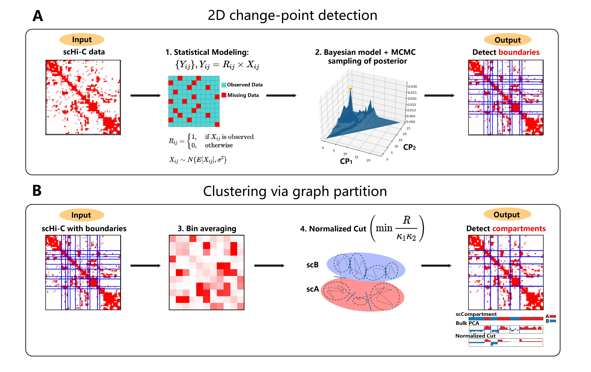

# Overview of scDIAGRAM
<div align="center">

</div>
This is the code for scDIAGRAM: Detecting Chromatin Compartments from Individual Single-Cell Hi-C Matrix Using Statistical Modeling without Imputation or Reference Features. scDIAGRAM (single-cell compartments annotation by DIrect stAtistical modeling and GRAph coMmunity detection)  is a novel computational tool for annotating chromatin A/B compartments in single-cell Hi-C data. Unlike exisitng methods, scDIAGRAM uses direct statistical modeling and graph community detection to group genomic loci into A/B compartments, without relying on imputation of reference features.

# Input Formats
We treat each bulk/single-cell Hi-C data in the matrix form. scDIAGRAM accepts two input formats for Hi-C data:

**Input version v1:**
 * Format: Numpy array (`.npy`)
 * 2D array: Shape ($N_b \times N_b$) for one Hi-C matrix.
 * 3D array: Shape ($N_c\times N_b \times N_b$) for a single-cell Hi-C dataset.

Here $N_c$ is the cell number and $N_b$ is the number of bins. 

**Input version v2:**  
- Format: Contact `.pairs` file (typically used in Hi-C data analysis) or a filelist `.txt` listing all `.pairs` file names.
- Each row in `.pairs` represents one contact with the source and end positions.
- Contacts must be separated by chromosomes, as scDIAGRAM only processes intra-chromosomal contacts and analyzes each chromsome independently.

We recommend using **input format v2** (`.pairs`) for low-resolution data (e.g., 100 kb) to avoid memory issues. Note that the code internally converts **v2** to **v1** (`.npy`) during processing.

# Installation & Dependencies
This project is primarily written in Python. The required Python packages are:

+ `scipy`
+ `matplotlib`
+ `numpy`
+ `pandas`
+ `seaborn`
+ `sklearn`
+ `cooltools`
+ `cooler`


# Running scDIAGRAM
## 1. 2D Change-point Detection (MCMC)
The 1st step in scDIAGRAM models the compartment annotation as a 2D change-point detection problem, formulating a probabilistic model and using MCMC to sample the MLE.

### Usage
For human Hi-C data.
```bash
python MCMC.py --species hg --before True --start 20 --end 21 --step 1 --terminate 2000  
    --chr 1 --file data/Bulk_HSC_100k.npy --reference reference/hg19.autosomal.chrom.sizes --output HSC_Bulk_MCMC.npy
```
For mouse Hi-C data.
```bash
python MCMC.py --species mm --start 60 --end 61 --step 1 --terminate 2000 
    --chr 1 --file data/A10_A11.pairs --input_version v2 --output A10_A11_MCMC.npy
```
If you want to run with multiple cpus, use
```bash
python MCMC_parallel.py --species mm --file data/mBC_cell_ls.txt --start 60 --end 61 --step 1 --terminate 2000 
    --chr 1 --out_file mBC_chr1_tot_100k.out --ncpus 40 --input_version v2 --output mBC_MCMC.npy
```

The full list of parameters and their descriptions are given below:
| Parameter      | Description | Default |
| ----------- | ----------- | ----------- |
| file  | The file name of the input | Required |
| index  | The index of the cell in the dataset, start from 0 | 0 |
| chr   | The chromosome chosen, 1-22 for human and 1-19 for mouse | 7 |
| start      | CP number to start with       | Required|
| end   | CP number to end        |Required|
| step   | Step when changing CP number, generates CP numbers in `range(start, end, step)`         |1|
| terminate   | The iteration number to terminate in running MCMC        |10000|
| out_file  | The file to print out some intermediate results|single-cell_res.out|
| contact_thre  | Clip of the data in preprocessing, in percentile|99.9|
| before  | Only used in human data, run MCMC before or after the centromere|True|
| species | The species used, 'hg' (human) or 'mm' (mouse) | mm |
| resolution | The reslution used | 100000 |
| binary | Whether to binarize the matrix | False |
| input_version | The form of the input, 'v1' for .npy form, 'v2' for .pairs form | v1 |
| reference | The reference file providing the chromosome length of each chromosome | reference/mm10_chr_size.txt|
| output  | The output name| MCMC_res.npy |

There are one additional parameter used when implementing MCMC in parallel:
| Params      | Description | Default value |
| ----------- | ----------- | ----------- |
| ncpus  | The number of cpus (workers) to run when paralleling| 40 |

### Output
A `.npy` matrix of predicted CP positions for each cell, of shape $N_c \times K$, where $N_c$ is the cell number and $K$ is the CP number. 


## 2. Graph Partition (Normalized Cut)
The 2nd step performs normalized cut after CPs are determined. Just compute eigenvalues/eigenvectors after bin average. Its input consists of the original Hi-C input and the MCMC results from step 1.
### Usage
```bash
python S_AB.py --species hg --file data/Bulk_HSC_100k.npy --MH_file HSC_Bulk_MCMC.npy 
    --cpg_file reference/hg19.CpG.100000.txt --reference reference/hg19.autosomal.chrom.sizes
```
If you want to run with multiple cpus, use
```bash
python S_AB_parallel.py --file data/mBC_cell_ls.txt --chr 1 --MH_file mBC_MCMC.npy --input_version v2
```
Besides the shared parameters with the function MCMC in step 1, the additional parameters and their descriptions are given below:
| Params      | Description | Default value |
| ----------- | ----------- | ----------- |
| MH_file  | The MCMC results in step 1, used as the input for Ncut. | Required |
| cpg_file  | The CpG data used for alignment | reference/mm10.CpG.100000.txt |
| output_prefix  | The prefix to the output files | Ncut |
| output_dir  | The directory of the output files, it will generate subdirectories for each chromosome | DistAB |

### Output
The output in this step is the ultimate output of scDIAGRAM. It consists of 4 files (all stored in `.npy` forms): 
- Binary compartments for each cell, 2D array with shape $N_c \times N_b$. 
- Real-valued compartments for each cell, 2D array with shape $N_c \times N_b$. 
- Eigenvalues for each cell, 1D array with length $N_c$. 
- Compsc-Ncut we defined for each cell, 1D array with length $N_c$. 

Here $N_c$ is the cell number and $N_b$ is the number of bins.

## 3. Tutorial
### Bulk Hi-C example
First run
```bash
python MCMC.py --species hg --before True --start 20 --end 21 --step 1 --terminate 2000  
    --chr 1 --file data/Bulk_HSC_100k.npy --reference reference/hg19.autosomal.chrom.sizes --output HSC_Bulk_MCMC.npy
```
then run
```bash
python S_AB.py --species hg --file data/Bulk_HSC_100k.npy --MH_file HSC_Bulk_MCMC.npy 
    --cpg_file reference/hg19.CpG.100000.txt --reference reference/hg19.autosomal.chrom.sizes
```
Here we just test on 20 CPs, typically it's too small. We recommend using 40-60 CPs for Hi-C at 1 Mb, 60-100 for Hi-C at 100 kb. You can get reference values by visualizing CP numbers from bulk PCA. In practice, we recommend incrementally increasing the CP number until the A/B compartment assignments stablize.

### Single-cell Hi-C example
First run
```bash
python MCMC.py --species mm --start 60 --end 61 --step 1 --terminate 2000 
    --chr 1 --file data/A10_A11.pairs --input_version v2 --output A10_A11_MCMC.npy
```
Then run 
```bash
python S_AB.py --file data/A10_A11.pairs --input_version v2 --MH_file A10_A11_MCMC.npy
```

## 4. Miscellaneous Files

Some related functions are put in `misc/` folder. The descriptions are listed below:

| File      | Description |
| ----------- | ----------- |
| Bulk3-1.py; Bulk3-2.py     | Compute pseudo-bulk Hi-C, by pooling multiple single-cell Hi-C together. For Ex and In celltypes|
| hBulk1.py    | Compute pseudo-bulk Hi-C, for human Hi-C dataset|
| hBulk2.py    | Compute bulk compartment by bulk PCA|
| hCpG1-0.py    | Compute scCpG for human Hi-C dataset|
| Bulk4-3.py    | Compute bulk compartment by bulk PCA, for mouse dataset, on Ex celltype|
